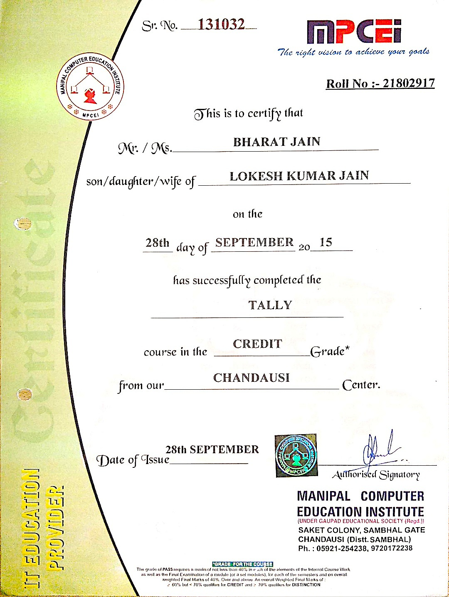

# CERTIFICAIONS

* When I got certified in `Tally` from `MPCEI`
* When I got certified in `Ethical Hacking` from `IIT Bhubaneswar`
* When I got certified in `Networking Concepts and Subnetting` from `KONARK Solutions & Services`
* When I got certified in `Data Analytics using Excel` from `KONARK Solutions & Services`
* When I got certified in `IMUN Conferrence` from `IMUN Online Conference`
* When I got certified in `Google Analytics for Beginners` from `Google`
* When I got certified in `Magento Community Edition 2 Essential Training Original` from `LinkedIn Learning`
* When I got certified in `Introduction to Data Science in Python` from `University of Michigan`
* When I got certified in `Introduction to Software Product Management` from `University of Alberta`
* When I got certified in `Python` from `Kaggle`
* When I got certified in `Intro to Machine Learning` from `Kaggle`
* When I got certified in `Intermediate Machine Learning` from `Kaggle`
* When I got certified in `Pandas` from `Kaggle`
* When I got certified in `Matplotlib Tuitorial` from `Udemy`
* When I got certified in `Chatbot Deployment (RASA)` from `Udemy`

 

## 1. When I got certified in `Tally` from `MPCEI`

 

## 2. When I got certified in `Ethical Hacking` from `IIT Bhubaneswar`

 

## 3. When I got certified in `Networking Concepts and Subnetting` from `KONARK Solutions & Services`

 

## 4. When I got certified in `Data Analytics using Excel` from `KONARK Solutions & Services`

 

## 5. When I got certified in `IMUN Conferrence` from `IMUN Online Conference`

 

## 6. When I got certified in `Google Analytics for Beginners` from `Google`

 

## 7. When I got certified in `Magento Community Edition 2 Essential Training Original` from `LinkedIn Learning`

 

## 8. When I got certified in `Introduction to Data Science in Python` from `University of Michigan`

 

## 9. When I got certified in `Introduction to Software Product Management` from `University of Alberta`

 

## 10. When I got certified in `Python` from `Kaggle`

 

## 11. When I got certified in `Intro to Machine Learning` from `Kaggle`

 

## 12. When I got certified in `Intermediate Machine Learning` from `Kaggle`

 

## 13. When I got certified in `Pandas` from `Kaggle`

 

## 14. When I got certified in `Matplotlib Tuitorial` from `Udemy`

 

## 15. When I got certified in `Chatbot Deployment (RASA)` from `Udemy`

